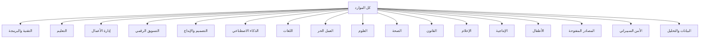

# التصنيفات (Taxonomy)

## الهيكل الهرمي للتصنيفات



## التصنيفات الرئيسية الكاملة

### 1. التقنية والبرمجة (Technology & Programming)
```
التقنية والبرمجة
├── تطوير الويب (Web Development)
│   ├── HTML/CSS
│   ├── JavaScript/TypeScript
│   ├── React/Next.js
│   ├── Vue.js/Nuxt
│   ├── Angular
│   ├── Backend
│   │   ├── Node.js
│   │   ├── Python/Django
│   │   ├── PHP/Laravel
│   │   ├── Ruby on Rails
│   │   ├── Java/Spring
│   │   └── Go
│   ├── APIs
│   │   ├── REST
│   │   ├── GraphQL
│   │   └── WebSockets
│   └── Databases
│       ├── SQL (PostgreSQL, MySQL)
│       ├── NoSQL (MongoDB, Redis)
│       └── ORMs
├── تطوير التطبيقات (Mobile Development)
│   ├── React Native/Expo
│   ├── Flutter
│   ├── Swift/iOS
│   ├── Kotlin/Android
│   └── Cross-platform
├── الحوسبة السحابية (Cloud Computing)
│   ├── AWS
│   ├── Google Cloud
│   ├── Azure
│   ├── Docker/Kubernetes
│   ├── DevOps/CI/CD
│   └── Serverless
├── الأمن السيبراني (Cybersecurity)
│   ├── Ethical Hacking
│   ├── Network Security
│   ├── Application Security
│   ├── Cryptography
│   └── Compliance
├── علم البيانات (Data Science)
│   ├── Machine Learning
│   ├── Deep Learning
│   ├── Data Engineering
│   ├── Data Visualization
│   └── Big Data
├── أنظمة التشغيل (Operating Systems)
│   ├── Linux
│   ├── Windows
│   └── macOS
├── الشبكات (Networking)
│   ├── CCNA
│   ├── Network Protocols
│   └── Network Administration
└── الخوارزميات وهياكل البيانات
    ├── Algorithms
    ├── Data Structures
    └── Competitive Programming
```

### 2. الذكاء الاصطناعي (Artificial Intelligence)
```
الذكاء الاصطناعي
├── نماذج لغوية كبيرة (LLMs)
│   ├── GPT/OpenAI
│   ├── Claude/Anthropic
│   ├── Gemini/Google
│   ├── Llama/Meta
│   ├── DeepSeek
│   └── Mistral
├── هندسة البرمجيات بالذكاء الاصطناعي
│   ├── Prompt Engineering
│   ├── RAG (Retrieval-Augmented Generation)
│   ├── Agents
│   ├── MCP (Model Context Protocol)
│   └── Fine-tuning
├── الرؤية الحاسوبية (Computer Vision)
│   ├── Image Generation (Stable Diffusion, DALL-E, Midjourney)
│   ├── Video Generation
│   ├── Object Detection
│   └── Face Recognition
├── معالجة الصوت (Audio/Speech)
│   ├── Speech-to-Text
│   ├── Text-to-Speech
│   ├── Music Generation
│   └── Voice Cloning
├── أدوات AI
│   ├── مساعدي البرمجة (Copilot, Cursor, Codeium)
│   ├── أدوات البحث (Perplexity, Consensus)
│   ├── أدوات الكتابة (Grammarly, QuillBot)
│   ├── أدوات التصميم (Canva AI, Leonardo)
│   └── أدوات الفيديو (Runway, Pika, HeyGen)
└── نماذج مفتوحة (Open Source)
    ├── Hugging Face
    ├── Replicate
    └── Together AI
```

### 3. التصميم (Design)
```
التصميم
├── التصميم الجرافيكي (Graphic Design)
│   ├── Adobe Photoshop
│   ├── Adobe Illustrator
│   ├── Canva
│   └── Figma
├── تجربة المستخدم (UX Design)
│   ├── User Research
│   ├── Information Architecture
│   ├── Prototyping
│   └── Usability Testing
├── واجهات المستخدم (UI Design)
│   ├── Design Systems
│   ├── Material Design
│   ├── Mobile UI
│   └── Web UI
├── التصميم ثلاثي الأبعاد (3D Design)
│   ├── Blender
│   ├── Maya
│   └── Cinema 4D
├── الموشن جرافيك (Motion Graphics)
│   ├── Adobe After Effects
│   └── Animation Principles
└── العمارة والتصميم الداخلي
```

### 4. إدارة الأعمال (Business)
```
إدارة الأعمال
├── ريادة الأعمال (Entrepreneurship)
│   ├── Startup
│   ├── Business Model
│   ├── Funding
│   └── Lean Startup
├── إدارة المشاريع (Project Management)
│   ├── PMP
│   ├── Agile/Scrum
│   ├── Jira
│   └── Microsoft Project
├── القيادة (Leadership)
├── الموارد البشرية (HR)
├── المحاسبة (Accounting)
├── الاستثمار (Investment)
├── إدارة الجودة (Quality Management)
│   ├── Six Sigma
│   └── ISO Standards
└── التجارة الإلكترونية (E-commerce)
```

### 5. التسويق الرقمي (Digital Marketing)
```
التسويق الرقمي
├── SEO (Search Engine Optimization)
│   ├── On-Page SEO
│   ├── Off-Page SEO
│   └── Technical SEO
├── SEM/PPC (Google Ads)
├── التسويق عبر المحتوى (Content Marketing)
├── التسويق عبر وسائل التواصل (Social Media Marketing)
│   ├── Instagram
│   ├── TikTok
│   ├── LinkedIn
│   ├── Twitter/X
│   └── Facebook
├── البريد الإلكتروني (Email Marketing)
├── التسويق بالعمولة (Affiliate Marketing)
├── Copywriting
├── تحليلات التسويق (Marketing Analytics)
│   ├── Google Analytics
│   └── Data-Driven Marketing
└── بناء العلامة التجارية (Branding)
```

### 6. اللغات (Languages)
```
اللغات
├── اللغة الإنجليزية
│   ├── General English
│   ├── Business English
│   ├── IELTS/TOEFL
│   └── English for Tech
├── اللغة التركية
├── اللغة الفرنسية
├── اللغة الألمانية
├── اللغة الإسبانية
├── اللغة الصينية
├── اللغة الروسية
└── لغات أخرى
```

### 7. الإنتاجية (Productivity)
```
الإنتاجية
├── أدوات الإنتاجية
│   ├── Notion
│   ├── Obsidian
│   ├── Todoist
│   ├── Trello/Notion
│   └── Google Workspace
├── إدارة الوقت (Time Management)
│   ├── Pomodoro
│   ├── GTD
│   └── Time Blocking
├── العادات (Habits)
├── الملاحظات (Note-taking)
├── الأتمتة (Automation)
│   ├── Zapier/Make
│   └── IFTTT
└── الصحة النفسية والإنتاجية
```

### 8. العمل الحر (Freelancing)
```
العمل الحر
├── منصات العمل الحر
│   ├── Mostaql
│   ├── Upwork
│   ├── Fiverr
│   ├── Freelancer
│   └── Toptal
├── التوظيف عن بعد
│   ├── LinkedIn
│   ├── Remote OK
│   ├── We Work Remotely
│   └── Bayt
├── المهارات الحرة
├── إدارة العمل الحر
└── بناء السمعة
```

### 9. العلوم (Sciences)
```
العلوم
├── الرياضيات (Mathematics)
│   ├── Calculus
│   ├── Linear Algebra
│   ├── Statistics
│   └── Discrete Math
├── الفيزياء (Physics)
├── الكيمياء (Chemistry)
├── الأحياء (Biology)
├── الهندسة (Engineering)
│   ├── Computer Engineering
│   ├── Electrical Engineering
│   ├── Mechanical Engineering
│   └── Civil Engineering
└── الطب (Medicine)
    ├── Medical Studies
    ├── Pharmacy
    └── Nursing
```

### 10. الإعلام والمحتوى (Media)
```
الإعلام والمحتوى
├── صناعة المحتوى
│   ├── YouTube
│   ├── Blogging
│   ├── Podcasting
│   └── Newsletter
├── التصوير الفوتوغرافي
├── المونتاج (Video Editing)
│   ├── Adobe Premiere
│   ├── DaVinci Resolve
│   └── Final Cut Pro
├── الكتابة (Writing)
│   ├── Creative Writing
│   ├── Technical Writing
│   └── Academic Writing
└── الصحافة (Journalism)
```

### 11. المصادر المفتوحة (Open Source)
```
المصادر المفتوحة
├── Awesome Lists
│   ├── Awesome Python
│   ├── Awesome React
│   ├── Awesome AI
│   └── Awesome Self-Hosted
├── GitHub Repositories
├── مستودعات التعلم
│   ├── freeCodeCamp
│   ├── The Odin Project
│   └── Roadmap.sh
├── Kaggle
├── arXiv
└── الشهادات المفتوحة (Open Badges)
```

### 12. مجالات أخرى
```
- التعليم (Education) — شامل
- التعلم الذاتي (Self-Learning)
- المنح الدراسية (Scholarships)
- الكتب (Books) — مجانية/مفتوحة
- البودكاست (Podcasts)
- النشرات البريدية (Newsletters)
- المجتمعات (Communities)
- المؤتمرات (Conferences)
- المسابقات (Competitions)
- الشهادات المهنية (Certifications)
- الأطفال والتعليم المبكر
- الفنون (Arts)
- الموسيقى (Music)
- الزراعة (Agriculture)
- الطاقة المتجددة
- البيئة والاستدامة
```
